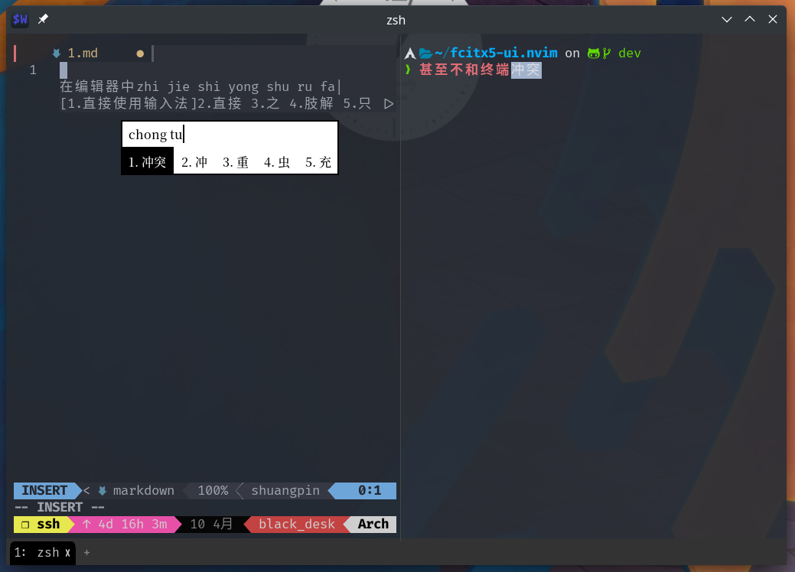

# Fcitx5 UI inside neovim

**WARNING**
This program is in very early stage and may break or change frequently\!

This is a fcitx5 user interface for neovim written in lua.

Basical fcitx5 functions seems work after a simple setup.



## Install

### rocks.nvim

#### Command style

```vim
:Rocks install fcitx5-ui.nvim
```

#### Declare style

`~/.config/nvim/rocks.toml`:

```toml
[plugins]
"fcitx5-ui.nvim" = "scm"
```

Then

```vim
:Rocks sync
```

or:

```sh
$ luarocks --tree ~/.local/share/nvim/rocks install fcitx5-ui.nvim
# ~/.local/share/nvim/rocks is the default rocks tree path
# you can change it according to your vim.g.rocks_nvim.rocks_path
```

### packer.nvim

``` lua
require('packer').use(
  "black-desk/fcitx5-ui.nvim",
  rocks = {'lgi', 'dbus_proxy'},
)
```

### lazy.nvim

``` lua
return {
  "black-desk/fcitx5-ui.nvim",
  config = config,
}
```

**NOTE**:

1. `lgi` and `dbus_proxy` needs `gobject-introspection` to build;
2. packer.nvim need `unzip` to install lua rocks;

## Config

The most config is same as
[rime.nvim](https://github.com/rimeinn/rime.nvim#frontend).
The only difference is trigger key which is used to switch input schema.

`~/.config/fcitx5/config`:

```dosini
[Hotkey/TriggerKeys]
0=Super+space

[Behavior]
# Share Input State
ShareInputState=No
```

By default, it will parse `~/.config/fcitx5/config`. You also can customize it.

```lua
local Fcitx = require 'fcitx.nvim.fcitx'.Fcitx
local Key = require 'fcitx.key'.Key
local fcitx = Fcitx{
  trigger = Key { normal_name = "Super+space" }
}
```

Old APIs for compatibility:

`require'fcitx5-ui'.activate()` to activate first input method,
then you can use `:startinsert` to enter insert mode.

`require'fcitx5-ui'.deactivate()` to deactivate input method.

`require'fcitx5-ui'.toggle()` to toggle between activate/deactivate.

`require'fcitx5-ui'.getCurrentIM()` to get current IM.

`require'fcitx5-ui'.setup(config)` to config this plugin.

## Thanks

[fcitx5.nvim][==link4==]

[lua-dbus\_proxy][==link5==]

[fcitx.vim][==link6==]

[==link1==]: https://github.com/fcitx/fcitx5/blob/master/src/lib/fcitx-utils/keysymgen.h
[==link2==]: https://github.com/fcitx/fcitx5/blob/master/src/lib/fcitx-utils/keysym.h
[==link3==]: https://github.com/black-desk/dotfiles/blob/e0af17d86b7719bac6d3c936b9ebdf4ffc3c22af/private_dot_config/nvim/lua/plugins-d/_fcitx.lua#L6-L28
[==link4==]: https://github.com/tonyfettes/fcitx5.nvim
[==link5==]: https://github.com/stefano-m/lua-dbus_proxy
[==link6==]: https://github.com/lilydjwg/fcitx.vim
